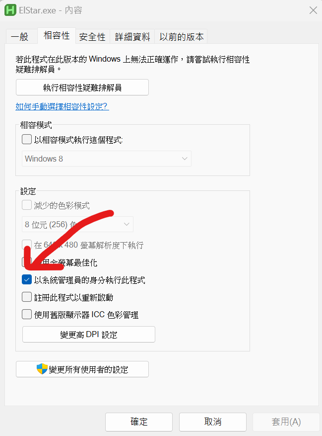
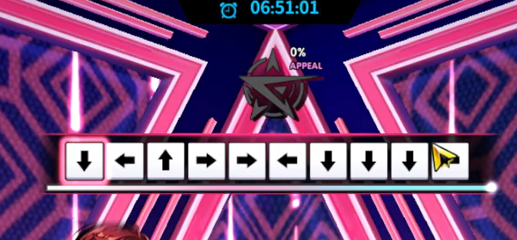
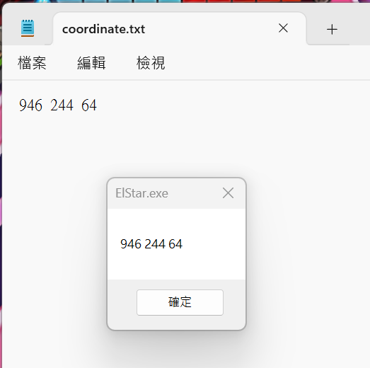
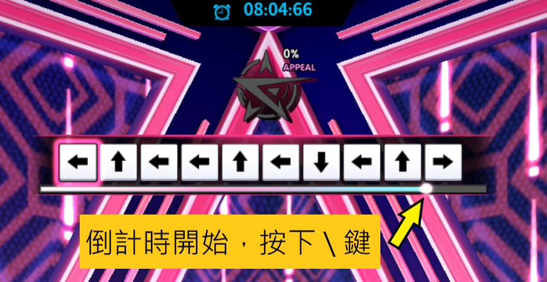

# EL★STAR 2 Hacker

## 下載
v1.1 [elstar.zip](https://github.com/Jaslayer/ElStar-hacker/releases/download/v1.1/elstar.zip)

## 初始設定
1. 將`elstar.zip`解壓縮
2. 設定管理員身分執行
   - 對`ElStar.exe`點右鍵 > 內容 > 相容性，將"以系統管理員身分執行此程式"打勾，按確定。
   
3. 截取方向鍵圖片
	1. 用不重要的分身進入EL★STAR副本，跑到跳舞機畫面。
	2. 分別截圖上、下、左、右方向鍵，將`arrow`資料夾裡的圖片取代成自己截取的圖片。
	   - 截取時不可截取到黑邊框，以能辨識方向為原則，圖片越小越好。
4. 設定偵測座標
	1. 啟動`ElStar.exe`，初次使用時會彈出小提醒，按確定。
	2. 用不重要的分身進入EL★STAR副本，跑到跳舞機畫面。
	3. 按下`Shift`+`\`，接著依序在**第一個**與**最後一個**方向鍵的**左上角各點擊一次**。完成後彈出視窗，顯示三個數字。
	   - 第一次點擊位置
	     
	
	   - 第二次點擊位置
	       
	4. 編輯`arrow`資料夾裡的`coordinate.txt`，將`0 0 0`取代成上一步驟所顯示的三個數字，儲存文件退出。
	   
	5. 按確定，程式自動關閉，設定完成。

## 使用方法
1. 啟動`ElStar.exe`。
2. 進入EL★STAR副本，跑到跳舞機畫面。
3. 在**第一次倒數進度條 開始倒數時**按下`\`鍵，開始跳舞。
4. 發呆。通關。
5. 連刷副本時，重複第2~4步驟。
- 按下`Ctrl`+`\`，可關閉程式。
